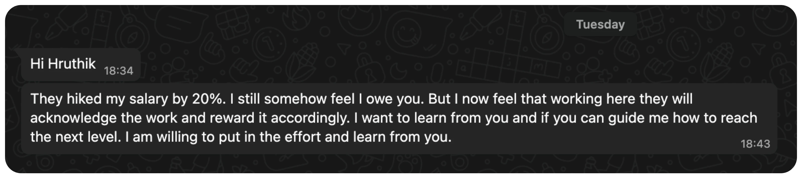

> "It is neither work nor play, purpose nor purposelessness that satisfies us. It is the dance between."
>
> –Bernard De Koven

A year ago, I paused building this developer education platform due to burnout.

A few months ago, I decided to bring it back—now including video content—while keeping everything 100% free. Monetization or a premium version may come later, but only if the [Frontend Hire YouTube channel](https://www.youtube.com/@FrontendHire) crosses 10k subscribers.

## Why bring it back?

I consider myself an above-average developer, but an even better educator. Education is where I want to make an impact, and _Frontend Hire_ is one of the ways. Also, one of the recent message from someone I mentored a while ago.

Now, imagine doing this at a scale!

## Motivation

Another motivation came back in June. A larger non-profit platform, led by a founder whose content I really like and reference a lot, approached me to merge. We didn’t move forward because I want to preserve the option for future monetization.

> "Your work is incredible and we want to help you grow."
>
> –the Founder

Another intrinsic motivation: teaching makes me a better developer. If I can’t clearly explain what I know, it’s a sign I need to improve.

## Keeping it short and content philosophy

Last time, I burned out trying to do too much. This time, it’s fewer things, at a slower pace.

Interview content won’t be the focus. I want people to truly improve while enjoying the process—clearing interviews should be a by-product of real skill. Of course, some interview processes can be frustrating, and in those cases, I’ll point to a few other resources mostly the below listed ones.

- Frontend Interviews (affiliate link) -> [GreatFrontEnd](https://www.greatfrontend.com/prepare/coding?fpr=hruthik-reddy22)
- General Interviews -> [Hello Interview](https://www.hellointerview.com/)
- System Design Simplified and Low Level Design (affiliate link) -> [Interview Ready](https://interviewready.io/checkout/?_aff=kkhqugif87496)

## New Content Since My Return

- **Astro-based Personal Website with CMS** (video coming soon) -> [Course Overview](https://www.frontendhire.com/learn/frontend/courses/marketing-website-with-zero-cost-cms/overview)

- **Stackpack Course (Video Format)** -> [Watch on YouTube](https://youtu.be/uA63G1pRchE)

- **Refactoring Series: Profile Page** -> [Course Overview](https://www.frontendhire.com/learn/frontend/refactoring/profile-page/overview)

- **Refactoring Series: Feature Flags** -> [Course Overview](https://www.frontendhire.com/learn/frontend/refactoring/feature-flags/overview)

- **Single Videos:**
  - Close `shadcn` Sidebar on Mobile Navigation -> [Watch on YouTube](https://youtu.be/9-Gci8_6Dss)
  - `Omit` and `Pick` Utilities -> [Watch on YouTube](https://youtu.be/jkDAOdtlpCQ)
