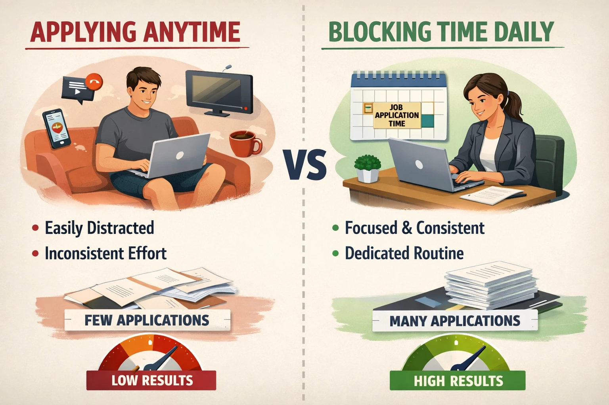

## First Open House of 2026

We caught up with a few members of our community and had a great conversation with their jobs and goals for the year.

With that said, the major topic of discussion was "Job Applications"

## Our Recommended Approach to Finding a Job

### Good Fit for Both You and the Company

[Read the job description](https://www.iamyhr.com/learnings/job-description-is-there-for-a-reason/) carefully and understand what the company is looking for.

> Job Description exists for a reason. You should match at **least 80%** of the requirement.

Now, it is very easy to neglect this when you don't timebox your job applications. Which brings us to our next point.

### Timeboxing

Do not depend on your energy or motivation to apply for jobs. Instead, timebox your job applications.

For example, you can set a timer for 1 hour and apply for jobs during that time. Once the timer goes off, stop applying for jobs.

Even better to make this a fixed schedule.

  I wanted to Excalidraw this but ended up using AI. Conveys the point, though I
  might have better illustrated it.

### System Design over Machine Coding

AI is getting better at generating code. Even if the code is not of great quality to begin with, we can still iterate towards greatness.

So, ideally, you should spend more time on system design and less time on machine coding. Bringing parts of your system design to life is what matters.

### Reach Out to Everyone

When you are looking for a job, start reaching out to everyone you know. Don't let your ego get in the way. All you need is one good offer.

## Bonus: Get Good at API design

This means get good at Frontend Component Design (a.k.a what props to pass to components) and Backend API design (a.k.a what endpoints to expose and what data to return).

This takes time and practice, but it is a skill that will serve you well in your career. Especially, when you start building MCP Servers.

---

This blog post was quickly ~AI-generated~ written by me using the sticky notes from the live session. Do join our [discord community](https://discord.gg/DWAVqksVtx) to get early access to the live sessions.

## What is an Open House?

An Open House is a free, informal community call where anyone can join, ask questions about frontend or web development, and connect with others. If no questions come up, we dive into topics like JavaScript, React, Next.js, SvelteKit, Supabase, or whatever the group is interested in. It’s about learning together and building real connections beyond just LinkedIn or Twitter.
