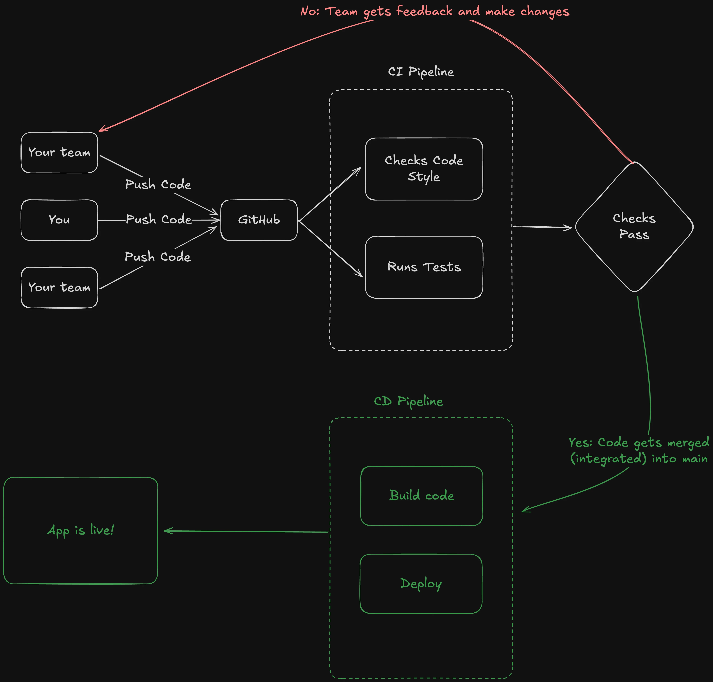

If you are a frontend developer, then highly likely that you might be little uncomfortable working with some non-frontend things. One of such things is `CI/CD`.

In fact, I did not touch this stuff (directly at least) for the first two years of my career.

## Introduction



1. Developers (you and your team) push code to GitHub.

2. The CI Pipeline (Continuous Integration) starts automatically:

   - It checks code style.

   - It runs tests to ensure everything works correctly.

   - Or anything that has to run before code can be merged.

3. If the checks pass, the code is merged into the main branch.

   - If not, the team gets feedback and makes the necessary changes.

4. Once merged, the CD Pipeline (Continuous Deployment) begins:

   - It builds the code.

   - It deploys the application.

   - If required to staging and dev environments also.

5. Finally, the app goes live!

## Course Content

A pretty straightforward content:

- A starter repo with `prettier`, `eslint`, and `tests` already set up. We just move those checks to the GitHub Actions Workflows.
- We also cover minor `eslint` configuration.

### Starter Repo

We have created a GitHub repository with the initial setup to make it easier for you. You can fork or clone the [repository](https://github.com/yaralahruthik/fh-ci-cd-todo-app) and start working on the project. The branch should be `0-init`.

1. Clone the repo:

```sh
git clone https://github.com/yaralahruthik/fh-ci-cd-todo-app.git
```

2. Then run the following commands:

```sh
cd fh-ci-cd-todo-app
pnpm install
```

3. Finally, run the dev server:

```sh
pnpm dev
```

4. Also, publish this to your own GitHub account, otherwise, you won't be able to follow up with the rest of the course.

In the next section, we will setup a CI pipeline with GitHub actions.
