## What is Pages CMS?

[Pages CMS](https://pagescms.org/) is a free, open-source content management system that works directly with your Git repository. It allows non-technical users to edit website content in a simple web interface—no need to touch code, Git, or Markdown directly.

The online version of Pages CMS makes setup easy: you don’t need to self-host, and everything stays in sync with your repo automatically. Though if you want to, you can self-host it easily.

## How does it work?

Pages CMS works by connecting directly to your GitHub repository. Instead of storing content in a separate database, it edits the Markdown (or other content) files that already live inside your repo.

Here’s the flow:

1. **User edits content**
   A user logs into Pages CMS and edits text, images, or metadata through a clean web interface.

2. **Pages CMS commits changes**
   When they hit save, Pages CMS creates a commit in your GitHub repository—just like a developer would.

3. **Your site rebuilds**
   Since your hosting provider (like Netlify or Vercel) is watching the repo, any new commit automatically triggers a rebuild and deployment.

4. **Updated site goes live**
   The updated content appears on the live website, with no developer involvement required.

In short: **Pages CMS acts as a Git-based editor for your content.** It gives users a friendly UI, while you still keep the simplicity and power of a fully static site.

## Setup Pages CMS

This is quite easy.

1. Sign In with your GitHub account [here](https://app.pagescms.org/sign-in).

2. Then you will be prompted to add an account.

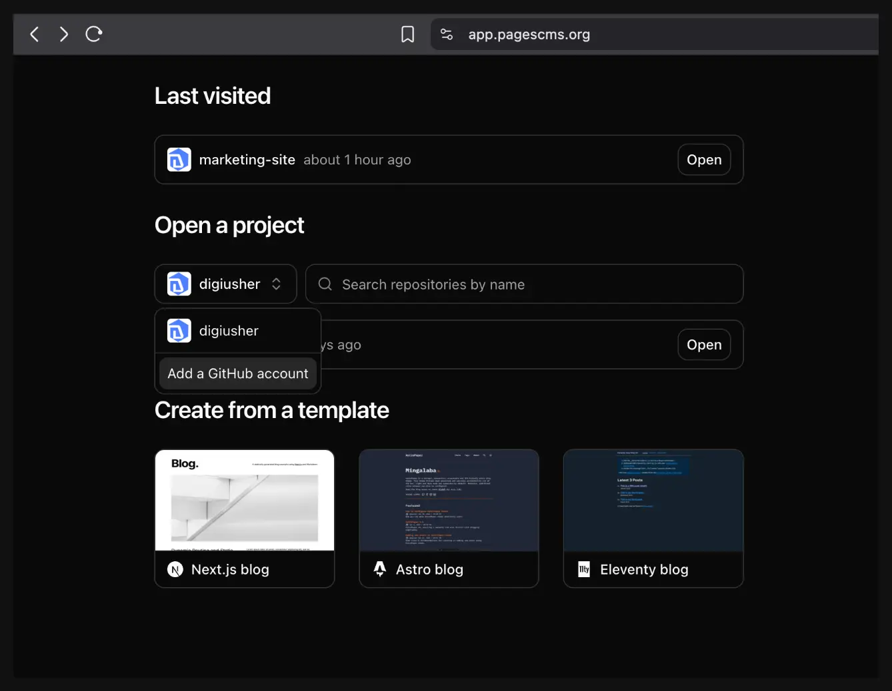

<Callout>
  If you notice, I already have my company's GitHub account linked here. I
  already use Pages CMS in production, I liked it, hence I am creating this
  course to teach you a great tool.
</Callout>

3. Choose the account where you want to install the Pages CMS client. (This is safe!)

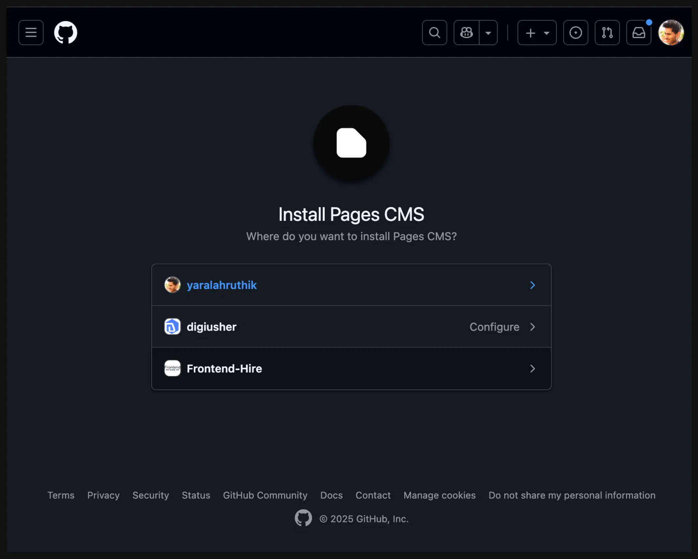

4. But ideally, only install it for select repositories for better security. (Highly recommended!)

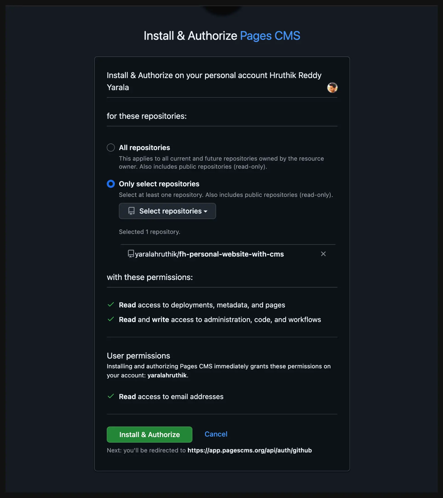

5. After installing the Pages CMS app, you will land up on a page asking you to create a configuration file. By the way, if you want to do this on a different branch you can do that by selecting the dropdown with your account to top-left.

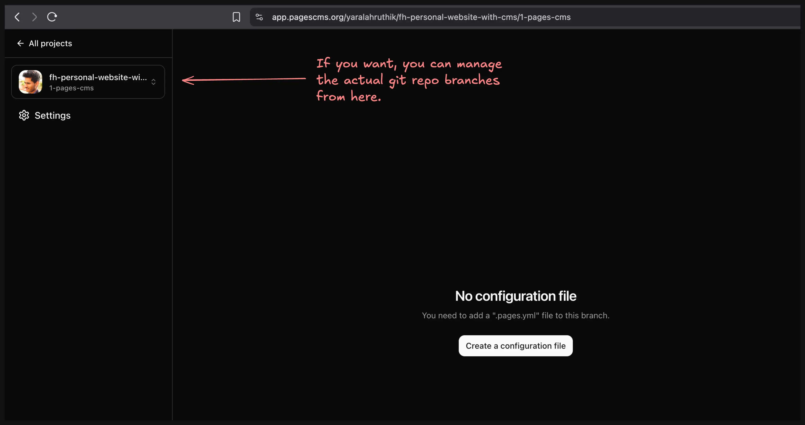

6. The moment you click on the "Create a configuration file", it creates a file and commits it to the repo.

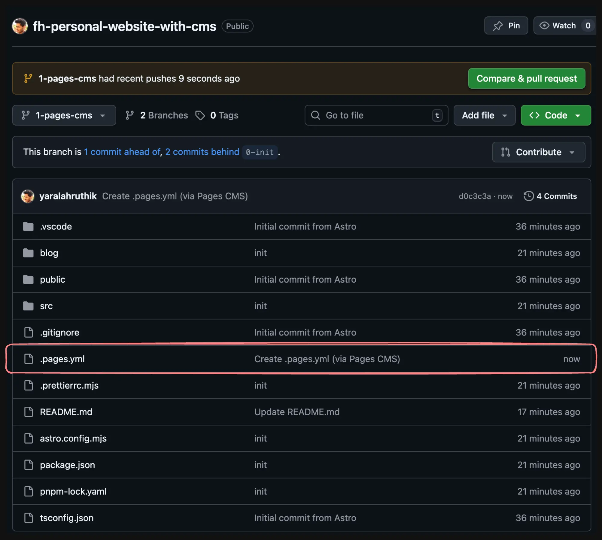

## Astro project structure

Let us quickly have a look at how our Astro project is structured.

<Files>
  <Folder name="blog" defaultOpen>
    <Folder name="assets" />
    <File name="first-post.md" />
    <File name="markdown-style-guide.md" />
    <File name="second-post.md" />
    <File name="third-post.md" />
  </Folder>
  <Folder name="node_modules" />
  <Folder name="public" />
  <Folder name="src" defaultOpen>
    <Folder name="components" />
    <Folder name="layouts" />
    <Folder name="pages" />
    <Folder name="styles" />
    <File name="consts.ts" />
    <File name="content.config.ts" />
  </Folder>
  <File name="astro.config.mjs" />
  <File name="package.json" />
  <File name="pnpm-lock.yaml" />
  <File name="tsconfig.json" />
</Files>

The "blog" content is at the root of the repository. This folder holds our assets (images) and individual blog posts as markdown files. You can quickly check out the structure of each blog post or have a look at the `content.config.ts`, this is an Astro feature that helps provide better type-safety with your content.

```md title="first-post.md"
---
title: 'First post'
description: 'Lorem ipsum dolor sit amet'
pubDate: 'Jul 08 2022'
heroImage: './assets/blog-placeholder-3.jpg'
---

Lorem ipsum dolor sit amet, consectetur adipiscing elit, sed do eiusmod tempor incididunt ut labore et dolore magna aliqua. Vitae ultricies leo integer malesuada nunc vel risus commodo viverra. Adipiscing enim eu turpis egestas pretium. Euismod elementum nisi quis eleifend quam adipiscing. In hac habitasse platea dictumst vestibulum. Sagittis purus sit amet volutpat. Netus et malesuada fames ac turpis egestas. Eget magna fermentum iaculis eu non diam phasellus vestibulum lorem. Varius sit amet mattis vulputate enim. Habitasse platea dictumst quisque sagittis. Integer quis auctor elit sed vulputate mi. Dictumst quisque sagittis purus sit amet.
```

```ts title="src/content.config.ts"
import { glob } from 'astro/loaders';
import { defineCollection, z } from 'astro:content';

const blog = defineCollection({
  loader: glob({ base: 'blog', pattern: '**/*.{md,mdx}' }),
  schema: ({ image }) =>
    z.object({
      title: z.string(),
      description: z.string(),
      pubDate: z.coerce.date(),
      heroImage: image().optional(),
    }),
});

export const collections = { blog };
```

These files should help you understand our blog posts structure.

We will now setup Pages CMS to work with this structure. We can do this with configuration file.

## `.pages.yml` configuration file

Let us first try to have a look at our assets (images in this case) through Pages CMS.

<Callout>
  We know this stuff because it is [well
  documented](https://pagescms.org/docs/)!
</Callout>

### Media

1. We tell Pages CMS, the location of our Media (assets) with `input`, and the relative path with the `output` (we will talk about `output` more soon).

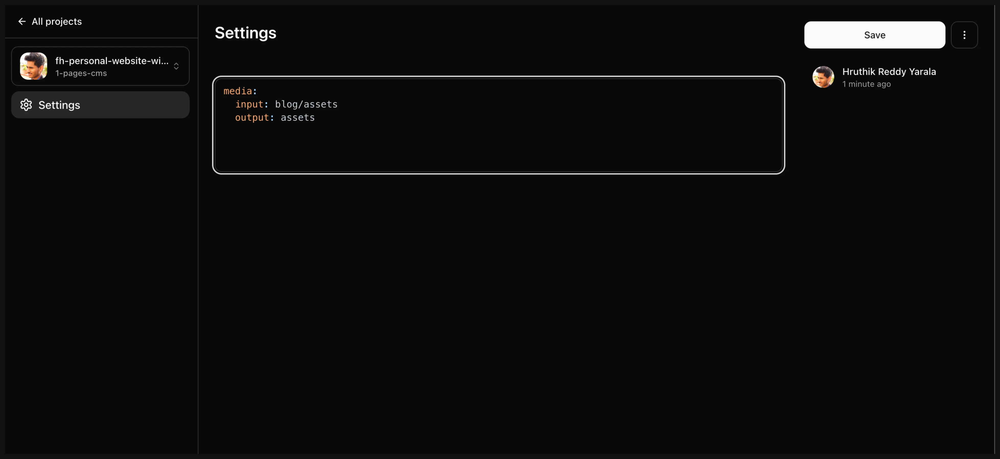

2. Save, and you should immediately see a `Media` tab on the dashboard.

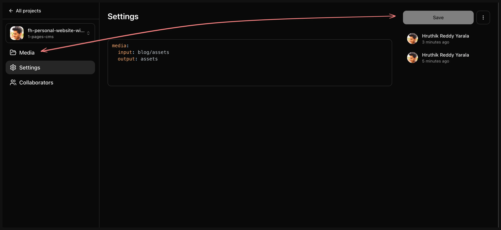

3. Check the `Media` tab out and you will see all the assets you have in the repo.

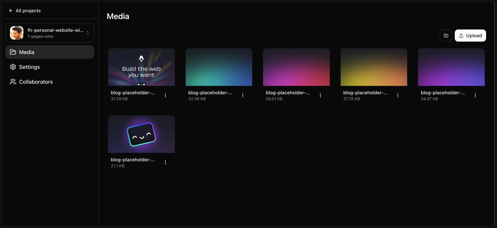

So, you should be getting the idea of how Pages CMS works. Let us now try to also wire up the actual content.

### Content

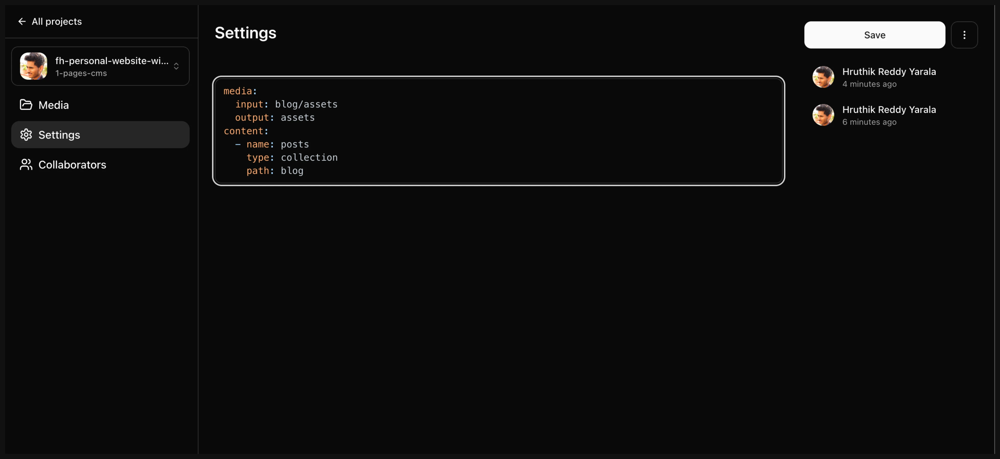

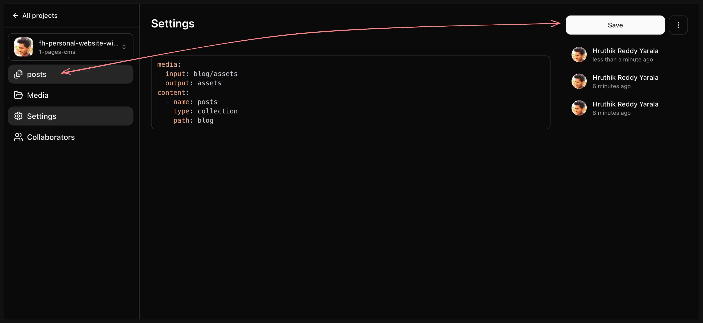

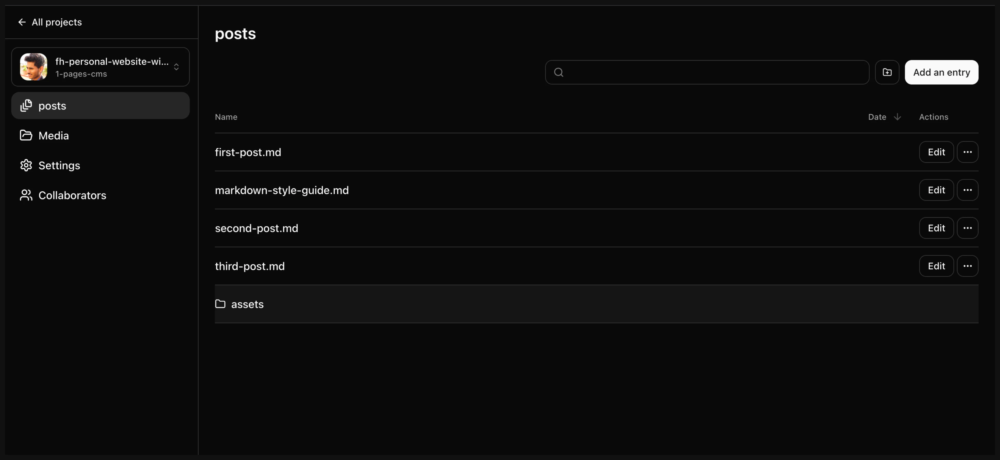

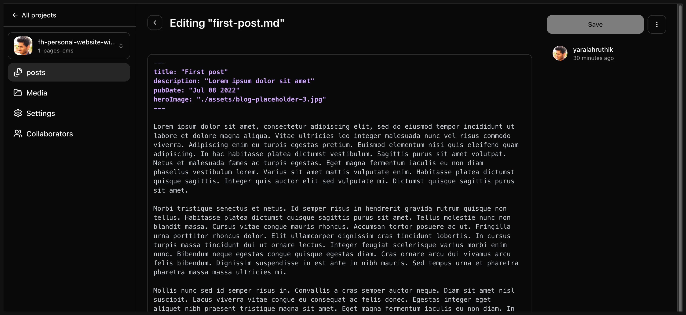

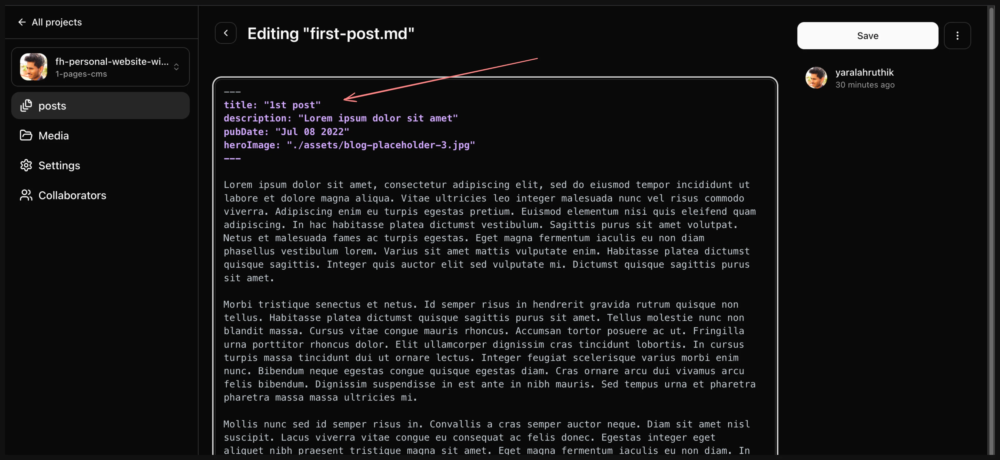

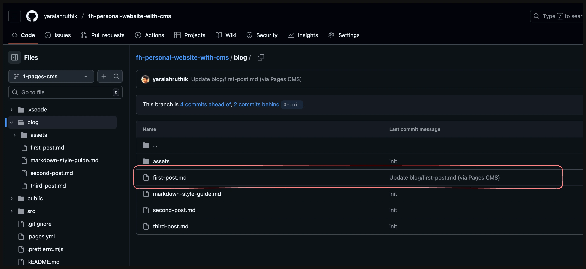

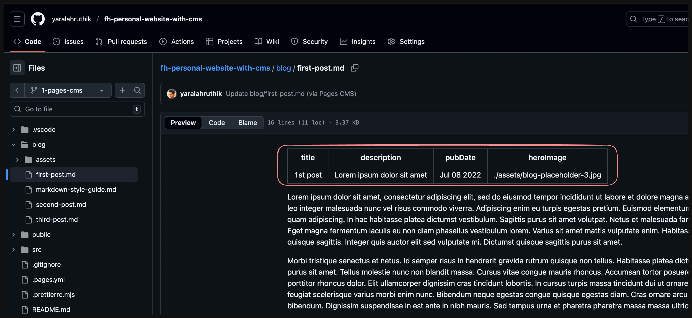
